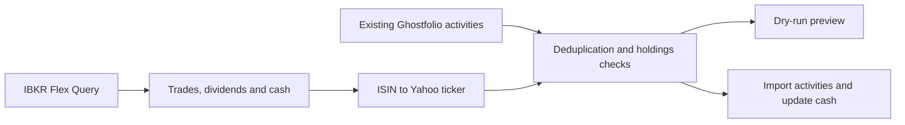

# ghostfolio-ibkr-sync

[](https://github.com/flowcool/ghostfolio-ibkr-sync/actions/workflows/docker-publish.yml)
[](https://github.com/flowcool/ghostfolio-ibkr-sync/actions/workflows/codeql.yml)
[](https://github.com/flowcool/ghostfolio-ibkr-sync/releases)

**Your IBKR trades, dividends and cash balance in self-hosted [Ghostfolio](https://ghostfol.io), on a daily schedule.**

| Import | Reconcile | Run |
| --- | --- | --- |
| Trades, dividend payments and withholding tax | Trade IDs, manual-entry matching and a holdings gate | Docker on amd64 / arm64, or plain Python |
| ISIN → Yahoo Finance ticker mapping | Separate Ghostfolio accounts for IBKR sub-accounts | One-off runs, cron scheduling and a preview with `DRY_RUN=1` |



[Get started](#get-started) · [Configuration](#configuration) · [Mapping](#mapping-file) · [Troubleshooting](#troubleshooting) · [Limitations](#limitations) · [Contribute](CONTRIBUTING.md)

## Get started

1. Configure [IBKR Flex Web Service and your query](#ibkr-setup), then [create your Ghostfolio account and token](#ghostfolio-setup). Use the same account currency as the IBKR base currency.
2. Copy [`mapping.yaml.example`](mapping.yaml.example) to `mapping.yaml` and review your securities' Yahoo tickers. The mapping file must exist unless you explicitly disable it.
3. Run the [Docker preview](#dry-run-first) with `DRY_RUN=1`. Review ticker mappings, skipped trades and the proposed cash balance before enabling writes.
4. Run [once](#single-account-one-off-run), then configure [scheduled runs](#docker-compose--portainer). After the first import, gather historical market data in Ghostfolio.

**Before importing:** back up Ghostfolio using your deployment's backup procedure. The sync adds activities and updates cash; there is no automatic undo. The first Flex Query covers at most 365 days, so older positions must already be represented in Ghostfolio. Splits and other corporate actions need manual reconciliation. See [Limitations](#limitations).

## Overview

This tool fetches your IBKR activity statements via Flex Queries, parses trades and dividends, maps ISINs to Yahoo Finance tickers, and pushes everything into Ghostfolio. It handles multiple sub-accounts, deduplicates activities, updates cash balances, syncs dividend payments (including withholding tax), and skips FX conversions and options trades.

## Why this exists

This fork of [obol89/ghostfolio-ibkr-sync](https://github.com/obol89/ghostfolio-ibkr-sync) parses IBKR XML directly, uses only `requests` and `pyyaml` as runtime libraries, and keeps symbol mapping under your control. It is intended for investors operating their own Ghostfolio instance who want repeatable daily imports and visible reconciliation warnings.

## How it works

One run does this, in order:

1. Load the configuration and the symbol mapping. A missing or invalid mapping file stops the run before anything is contacted.
2. Read **all** existing Ghostfolio activities once. Deduplication depends on them, so if the list looks incomplete or redacted the run stops and writes nothing.
3. Then, for each IBKR account in turn (steps 3 to 6): fetch its Flex Query report (two steps: request, then poll until IBKR has generated the statement), find the Ghostfolio account by name (if `GHOST_ACCOUNT_NAMES` is unset, the IBKR account IDs are used as names, with a warning), and parse trades, dividend payments and the cash balance.
4. Decide what is new: skip FX and options; skip trades already in Ghostfolio (`IBKR#<tradeID>` comment) and trades without a trade ID (they cannot be deduplicated); skip dividends already in Ghostfolio (`dividend#...` comment, or any dividend of the same symbol in the same account within ±3 days); skip trades already entered by hand; and check the net quantity against existing holdings. This is a batch-level guard, not chronological position reconciliation.
5. Convert what is left to Ghostfolio activities and import them as a batch per account. If Ghostfolio reports an unresolved symbol, remove that symbol from the batch and retry the rest; the run still exits 1 so the omitted activities remain visible.
6. Set the account's cash balance. This happens even if the import failed; it is skipped, with a warning, only when the report has no base-currency cash row. After all accounts, the run exits `0` if every account was clean and `1` otherwise.

The tool never deletes or edits an existing Ghostfolio activity: it only adds new ones and updates each account's cash balance (and its platform, if `GHOST_PLATFORM_ID` is set and the account has none). Add `DRY_RUN=1` to see the whole decision without any write (see [Dry run first](#dry-run-first)).

Activities are read from `assetProfile` on current Ghostfolio APIs (the legacy
`SymbolProfile` response field was removed in 3.78.0). Legacy-only responses
remain supported for older versions. If both fields are present, `assetProfile`
takes precedence. BUY, SELL and DIVIDEND activities must have a profile with a
nonempty string `symbol`; otherwise the run stops before any import or cash
balance update. ISIN remains optional, as some assets do not have one.

## Docker image

```
ghcr.io/flowcool/ghostfolio-ibkr-sync:latest
```

Multi-arch image (linux/amd64 and linux/arm64). New images are published automatically on every push to main.

Tagged releases (see [Releases](https://github.com/flowcool/ghostfolio-ibkr-sync/releases)) are also published as `:X.Y.Z` and `:X.Y`. Select a full version for controlled upgrades; record the deployed image digest for a reproducible rollback, since container tags are mutable. `:latest` always follows main. CI also refreshes the main image weekly. See [build and release guarantees](.github/BUILD.md).

The running version is logged at container start and at the beginning of every sync:

```
ghostfolio-ibkr-sync version v1.2.0
2026-10-01 06:05:00 [INFO] Starting IBKR to Ghostfolio sync (version v1.2.0)
```

`:latest` reports `vX.Y.Z-N-g<sha>` (N commits after the last release, exact commit `<sha>`).

## Prerequisites

- A running self-hosted Ghostfolio instance, version **2.248.0 or newer**
- An Interactive Brokers account with Flex Web Service enabled
- Docker (for containerised runs) or Python 3.12+ with `requests` and `pyyaml` (CI and the container use Python 3.12)

The tool reads existing activities via `GET /api/v1/activities`, which landed in Ghostfolio 2.248.0. The `/api/v1/order` endpoints it replaced were deprecated in that same release and removed in 3.5.0, so on Ghostfolio 3.x this is the only endpoint that works.

## IBKR Setup

### 1. Enable Flex Web Service

1. Log in to IBKR Client Portal or Account Management
2. Go to **Settings** - **Reporting** - **Flex Queries**
3. At the bottom of the page, find **Flex Web Service** and click **Configure**
4. Generate a new token (or note your existing one)
5. Set the expiration to **1 year** so you do not have to rotate it frequently
6. Save the token - you will need it as `IBKR_TOKEN`

### 2. Create a Flex Query

**Important:** If you have multiple sub-accounts, create one Flex Query per sub-account. See the multi-account section below before creating your queries.

1. On the same Flex Queries page, click **Create** under **Activity Flex Query**
2. Give it a name like `Ghostfolio Sync - Individual`
3. Set the period to **Last 365 Calendar Days**

   > **⚠️ Critical — do not use a shorter period (e.g. Last Month, Last Quarter)**
   >
   > 365 days is the widest period IBKR allows. A wide window lets the sync recover
   > trades missed during a gap in daily runs (container down, expired token), as long
   > as they are still inside the period. A shorter period causes two classes of silent
   > failures:
   >
   > - **Missing trades**: trades older than the period are never seen, and a sell whose
   >   buy is outside the window is imported only if Ghostfolio already holds that buy
   >   (see [What the tool skips automatically](#what-the-tool-skips-automatically)).
   > - **New historical candidates when widening the period**: trade-ID dedup still
   >   recognises previously synced activities, but older manual entries or activities
   >   from another importer may need reconciliation before importing the wider report.
   >
   > **Recovery if you already used a shorter period:** review existing activities
   > against the statement before widening the query. The repository contains
   > `cleanup_duplicates.py` and `cleanup_dividends.py`. They require matching
   > account, currency and asset-profile identity, unique one-to-one matches,
   > and fresh records before mutation. These checks cannot prove that two
   > similar payments represent the same event, and the tools do not provide
   > transactional protection against concurrent edits. Review every proposed
   > pair against the statement and take a verified backup before `--apply`;
   > dry-run output alone is not proof that deletion is safe. These tools are
   > not included in the Docker image.
   > Dividend cleanup lists candidates up to 35 days apart in dry-run, but
   > `--apply` keeps both records unchanged when their dates differ by more than
   > 7 days and exits 1. Verify distant ex-date/payment-date pairs manually;
   > there is no bypass flag. A shorter date gap still does not prove event identity.

4. Select the following sections and fields:

**Account Information:**
- ClientAccountID
- CurrencyPrimary

**Cash Report:**
- CurrencyPrimary
- EndingCash

**Trades (Execution):**

Select these fields for a predictable report. The parser ignores additional attributes, but missing required values can cause trades to be skipped:

- ClientAccountID
- CurrencyPrimary
- AssetClass
- SubCategory
- Symbol
- Description
- ISIN
- FIGI
- TradeID
- Multiplier
- DateTime
- TradeDate
- IBCommission
- IBCommissionCurrency
- Open/CloseIndicator
- Buy/Sell
- Exchange
- Quantity
- TradeMoney
- TradePrice

**Cash Transactions:**

In the section options, tick only these types: **Dividends**, **Payment In Lieu Of Dividends**, **Withholding Tax**, and the **Detail** level of detail. Then select these fields:

- ClientAccountID
- CurrencyPrimary
- AssetClass
- Symbol
- Description
- ISIN
- FIGI
- Date/Time
- Amount
- Type
- LevelOfDetail (if listed)

Dividends are read from these actual cash payments, not from dividend accruals: IBKR marks accrual corrections, cancellations and payouts all with the same code, so accruals produce phantom and duplicate dividends. Cash Transactions also give the withholding tax actually paid. The **Change in Dividend Accruals** section is no longer used and can be removed from the query.

> **Upgrading from an older version:** add the Cash Transactions section before running the new image. Without it the run logs an `ERROR`, imports trades but no dividends, and exits 1. Dividends already in Ghostfolio are recognised by their `dividend#` comment, or by any dividend of the same symbol in the same account within 3 days, so they are not imported twice. Phantom dividends imported by older versions are not removed: check your IBKR dividends in Ghostfolio by hand.

5. Under **General Configuration**, set **Include Currency Rates** to **No**

   Currency-rate rows are not used by this tool. It does not convert the cash balance or commissions between currencies.

6. Save the query and note the Query ID (click the info icon next to the query to find it)

### 3. Multi-account setup

If you have multiple IBKR sub-accounts (for example individual and joint):

- Create **one Flex Query per sub-account**, with only that sub-account selected in the account filter
- Prefer **one container per sub-account** for independent scheduling and logs. One container can also process multiple accounts using equally sized, ordered `IBKR_ACCOUNT_IDS`, `IBKR_QUERY_IDS` and `GHOST_ACCOUNT_NAMES` lists. Each query must still select only its corresponding account.
- **Exclude paper trading or management accounts** that have no positions - these will cause errors

The tool processes each IBKR account independently and syncs it to a matching Ghostfolio account.

### 4. Find the Query ID

On the Flex Queries page, click the **info icon** (circle with "i") next to your query. The Query ID is displayed in the popup. You need this as `IBKR_QUERY_IDS`.

### 5. Data availability

Activity Statement data updates once daily after market close. Running the sync during market hours will only include trades from the previous day or earlier.

## Ghostfolio Setup

### 1. Choose how the sync authenticates

Set **exactly one** of these two variables (both set, or neither, stops the run with exit 1):

- **`GHOST_ACCESS_TOKEN` (recommended)** — the Ghostfolio *security token* you sign in with
  (shown when the user was created; Ghostfolio can generate a new one). At the start of every
  run, after the configuration and mapping file are validated and before anything is read from
  Ghostfolio or IBKR, the sync exchanges it once for a fresh session token via
  `POST /api/v1/auth/anonymous`. There is nothing to renew by hand. A dry run logs in too
  (logging in writes no financial data). The security token is long-lived: treat it like a
  password, and rotate it in Ghostfolio if it leaks.
- **`GHOST_TOKEN` (legacy)** — a session bearer you obtain yourself; it is used as is and
  **expires**, so you have to regenerate it periodically:

  ```bash
  curl -X POST http://localhost:3333/api/v1/auth/anonymous \
    -H 'Content-Type: application/json' \
    -d '{"accessToken": "YOUR_GHOSTFOLIO_SECURITY_TOKEN"}'
  ```

  The response contains an `authToken` field. Use it as `GHOST_TOKEN`.

With `GHOST_ACCESS_TOKEN`, `GHOST_HOST` must be a plain `http://` or `https://` URL (an
optional path is allowed): user credentials, a query string, a fragment, whitespace or control
characters are refused before any request. The login request does not follow redirects, so point
`GHOST_HOST` at the final Ghostfolio URL. A run never logs in again midway: if the session token
is refused later in the run, that run fails with exit 1 and the next run logs in afresh.

**Switching modes / rollback:** remove one variable and set the other, then recreate the
container. Images released before `GHOST_ACCESS_TOKEN` existed only understand `GHOST_TOKEN`:
when rolling back to one, set `GHOST_TOKEN` again first.

### 2. Create an IBKR Platform

1. Go to Ghostfolio **Admin** - **Platform**
2. Click **Add Platform**
3. Enter a name like `Interactive Brokers` and a URL like `https://www.interactivebrokers.com`
4. Save it

To find the Platform ID, query the API with a session token (the `authToken` returned by the curl command above):

```bash
curl http://localhost:3333/api/v1/platform \
  -H 'Authorization: Bearer YOUR_AUTH_TOKEN'
```

Look for the `id` field of the IBKR platform entry. Use this as `GHOST_PLATFORM_ID`.

### 3. Create accounts

Create one Ghostfolio account per IBKR sub-account:

1. Go to **Accounts** and click **Add Account**
2. Set the name to match what you will use in `GHOST_ACCOUNT_NAMES` (for example `IBKR Individual` or `IBKR Joint`)
3. Select the IBKR platform you created
4. Set the currency to match the sub-account base currency
5. Repeat for each sub-account

### 4. Add currencies

If your IBKR trades involve currencies that are not yet in Ghostfolio:

1. Go to **Admin** - **Market Data**
2. Search for and add any missing currency pairs (for example `USDEUR`, `USDGBP`, `USDCHF`)
3. Ghostfolio needs these to convert values to your base currency

### 5. After your first import

After the first sync, go to **Admin** - **Market Data** and click **Gather All Data**. This fetches historical prices from Yahoo Finance for all newly imported symbols. Without this step, portfolio values and performance charts will be incorrect. Run it again after adding symbols from a new import.

## Configuration

All configuration is done via environment variables:

| Variable | Required | Description | Example |
|---|---|---|---|
| `IBKR_TOKEN` | Yes | IBKR Flex Web Service token | `1234567890abcdef` |
| `IBKR_ACCOUNT_IDS` | Yes | Comma-separated IBKR account IDs | `U1234567` |
| `IBKR_QUERY_IDS` | Yes | Comma-separated Flex Query IDs (one per account) | `123456` |
| `GHOST_ACCESS_TOKEN` | One of these two | Ghostfolio security token, exchanged for a session token at the start of each run (recommended; see [Ghostfolio Setup](#1-choose-how-the-sync-authenticates)) | `a1b2c3...` |
| `GHOST_TOKEN` | One of these two | Ghostfolio session bearer token, used as is (legacy; expires) | `eyJhbGciOi...` |
| `GHOST_HOST` | Yes | Ghostfolio base URL | `http://ghostfolio:3333` |
| `GHOST_CURRENCY` | No | Legacy setting, currently unused; it does not override or convert currencies | `EUR` |
| `GHOST_PLATFORM_ID` | No | Platform ID for IBKR in Ghostfolio | `abc123-def456` |
| `GHOST_ACCOUNT_NAMES` | No | Comma-separated Ghostfolio account names (must match account count) | `IBKR Individual` |
| `MAPPING_FILE` | No | Path to symbol mapping YAML (default: `mapping.yaml`). The run stops (exit 1) if the file is missing or invalid; set it to an empty value (`MAPPING_FILE=""`) to run without mappings on purpose | `/app/mapping.yaml` |
| `CRON` | No | Cron schedule for recurring runs (Docker only) | `0 6 * * *` |
| `TZ` | No | Timezone for cron scheduling | `Europe/Warsaw` |
| `LOG_LEVEL` | No | Logging verbosity: `DEBUG`, `INFO`, `WARNING`, `ERROR` (default: `INFO`) | `DEBUG` |
| `APPRISE_URLS` | No | JSON list of [Apprise](https://github.com/caronc/apprise/wiki) URLs to notify when a run fails (blank or `[]` = off); see [Failure notifications](#failure-notifications-apprise) | `["ntfy://ntfy.sh/my-topic"]` |
| `APPRISE_TIMEOUT` | No | Seconds allowed for one notification, integer 1-30 (default `10`) | `10` |
| `DRY_RUN` | No | If truthy (`1`/`true`/`yes`/`on`), runs the full pipeline (fetch, convert, dedup) and logs the activities and cash balance it *would* write, without POSTing/PUTting to Ghostfolio | `1` |

## Mapping File

The mapping file maps ISINs to Yahoo Finance ticker symbols. This is necessary because IBKR identifies securities by ISIN while Ghostfolio uses Yahoo Finance tickers for price data.

### Format

Use a `symbol_mapping` key at the top level (a missing or empty key is treated as an empty mapping with a warning):

```yaml
symbol_mapping:
  IE00B52MJD48: EIMI.L        # iShares MSCI EM IMI - London
  DE0002635307: EXSA.DE       # iShares STOXX Europe 600 - Frankfurt
  IE00B4L5Y983: IWDA.AS       # iShares Core MSCI World - Amsterdam
  CH0110869143: CHSPI.SW      # iShares Core SPI - Swiss Exchange
```

### Which symbols need mapping

US-listed securities (VOO, QQQ, NVDA, AAPL, etc.) are recognised by Yahoo Finance using the IBKR symbol directly, so they do not need an explicit mapping.

European ETFs and stocks require mapping because Yahoo Finance uses exchange suffixes that differ from IBKR symbols:

| Exchange | Suffix | Example |
|---|---|---|
| London Stock Exchange | `.L` | `EIMI.L` |
| Frankfurt / Xetra | `.DE` | `EXSA.DE` |
| Amsterdam | `.AS` | `IWDA.AS` |
| SIX Swiss Exchange | `.SW` | `CHSPI.SW` |

### Finding Yahoo Finance tickers

1. Go to [finance.yahoo.com](https://finance.yahoo.com)
2. Search for the security by name or ISIN
3. Use the ticker shown on the Yahoo Finance page, including the exchange suffix

### Unmapped ISINs

When the script encounters an ISIN not in the mapping file, it falls back to the IBKR symbol and **attempts to import the activity**. If Ghostfolio cannot resolve that ticker, the tool drops its activities, imports the remaining activities if any remain, and exits 1. At the end of the run it logs one self-contained warning per ISIN:

```
[WARNING] Unmapped ISIN JP3637000005 (TRINITY INDUSTRIAL CORP) uses IBKR symbol '6382.T' as ticker (fallback) — verify in Ghostfolio or add to mapping symbol_mapping: 'JP3637000005: <yahoo ticker>'
```

If the fallback ticker is wrong for Yahoo Finance, add the ISIN to your mapping file with the correct ticker. Trades are reported only on the run that imports them; dividends on the fallback are reported on every run.

## What the tool skips automatically

- **FX conversion trades** - trades with assetCategory `CASH` are currency conversions, not investment positions
- **Options trades** - trades with assetCategory `OPT` are skipped (Ghostfolio does not support options)
- **Sells that would make a position negative** - the Flex Query only covers 365 days, so a sell of a position bought earlier arrives without its buy. For each security (per Ghostfolio account, by the ticker it will be imported under), the tool adds the quantity Ghostfolio already holds to the net quantity of IBKR trades not yet imported. If the result is zero or more, the candidates pass the first check. Buys and dividends are submitted first; sells are checked again using only newly created buys confirmed by the server response. If it would go negative, that security is refused by the initial check. If the second check fails, successful buys from the first phase remain and the sells are skipped.
- **Sells you already entered by hand** - an IBKR sell is treated as already recorded when Ghostfolio has a manual sell (no `IBKR#` comment) of the same quantity within ±2 days, under any symbol sharing the ISIN. Several IBKR fills of one day are also matched against a single manual entry by their sum. When a manual sell is nearby but the quantity does not match, the sell is not imported and a warning asks you to check by hand.
- **Buys you already entered by hand** - the same rule applies to buys (manual buy without `IBKR#` comment, same quantity, ±2 days, any symbol sharing the ISIN, fills matched by their sum). Unlike sells, a skipped buy is **always** reported as a `WARNING` naming the trade ID and the manual entry, because skipping it silently would hide a missing purchase. To silence the warning, put `IBKR#<tradeID>` in that manual entry's comment: the trade is then recognised by ID. If the match is a coincidence (a different purchase with the same quantity within 2 days), or a nearby manual buy has another quantity, the IBKR buy stays skipped (and warned about on every run) until you add it by hand or fix the manual entry. This is deliberate: a visible gap is safer than a silent duplicate.
- **Positions held under another symbol** - if Ghostfolio holds the security under a different symbol with the same ISIN (for example a manual entry on another listing), the sell is not imported and a warning gives the mapping line that fixes it.
- **Dividend reversals and orphan tax corrections** - dividend and withholding rows of the same security and day are summed; a net zero (reversed payment) is skipped, and a withholding tax row without a dividend that day is not imported and logged as a `WARNING` to check by hand.
- **Duplicate activities** - the tool checks existing Ghostfolio activities before importing and skips anything already present.

### Log levels

A clean, fully reconciled run normally emits only `INFO` lines. `WARNING` means *check this*, `ERROR` means *data is not in sync and needs action*:

| Level | Meaning |
|---|---|
| `DEBUG` | FX/options skipped, each sell not imported because already reconciled |
| `INFO` | Sells imported for long-held positions; one summary line of sells not imported (already entered manually, or no Ghostfolio position) |
| `WARNING` | Unmapped ISIN on symbol fallback; position held under another symbol; manual sell or buy nearby with another quantity; buy skipped because it matches a manual buy; withholding tax without a dividend the same day; network retry |
| `ERROR` | Ghostfolio holds some quantity but the IBKR sells exceed it — fix the position in Ghostfolio; IBKR/Ghostfolio request failures; run aborted before any write (see [Run stops before importing anything](#run-stops-before-importing-anything)) |

## How activities are converted

| Source (IBKR) | Ghostfolio activity |
|---|---|
| Trade | `BUY` when IBKR says `BUY`, otherwise `SELL`. Quantity and price are absolute values. The comment is `IBKR#<tradeID>`, the data source is always `YAHOO`. |
| Commission | `fee` = the commission cost. A positive `ibCommission` (a rebate) is recorded as a fee of 0 and logged as a `WARNING`, because Ghostfolio fees cannot be negative. |
| Dividend | One `DIVIDEND` per security and day: dividends and payments in lieu are summed (a reversal nets out), withholding tax becomes the `fee`. A net refund of tax is recorded as a fee of 0 with a `WARNING`. The comment is `dividend#<ISIN>#<date>` (or the IBKR symbol when there is no ISIN) and the date is the date of the cash transaction at 00:00 UTC. A dividend is treated as already present if Ghostfolio has that comment, **or any dividend of the same symbol in the same account within ±3 days** (so a real dividend that falls that close to a manual one is not imported). |
| Dividend quantity and price | Read from the description (`... USD 0.25 PER SHARE ...`): quantity = amount ÷ rate, rounded to whole shares when within 1 %, price derived so that quantity × price equals the payment. Without such a rate the whole amount is booked as one unit. |
| Date and time | IBKR timestamps are treated as UTC. A manual entry made in local time can differ by a day, which is why the manual-entry matching accepts ±2 days. |
| Currency | The trade or dividend currency, except on markets where Yahoo quotes the minor unit (below). |

**Minor-unit markets.** Yahoo Finance quotes some exchanges in the minor unit (pence, cents) while IBKR reports the major unit. For these the price **and** the fee (or withholding tax) are multiplied by 100 and the currency is changed so that amounts stay correct:

| Yahoo suffix | IBKR currency | Sent to Ghostfolio as | Status |
|---|---|---|---|
| `.L` (London) | GBP | GBp | verified on real trades |
| `.JO` (Johannesburg) | ZAR | ZAc | inferred, not verified |
| `.TA` (Tel Aviv) | ILS | ILA | inferred, not verified |

If you trade on `.JO` or `.TA` and amounts look 100 times off, check this table first.

## Running

### Single account (one-off run)

```bash
docker run --rm --network your-ghostfolio-network \
  -e IBKR_TOKEN=your_token \
  -e IBKR_ACCOUNT_IDS=U1234567 \
  -e IBKR_QUERY_IDS=123456 \
  -e GHOST_ACCESS_TOKEN=your_ghost_security_token \
  -e GHOST_HOST=http://ghostfolio:3333 \
  -e GHOST_ACCOUNT_NAMES="IBKR Main" \
  -v "$(pwd)/mapping.yaml:/app/mapping.yaml:ro" \
  ghcr.io/flowcool/ghostfolio-ibkr-sync:latest
```

### Without Docker

```bash
python3 -m venv .venv
.venv/bin/pip install -r requirements.txt
cp mapping.yaml.example mapping.yaml  # edit the copied mappings for your securities
export IBKR_TOKEN=your_token
export IBKR_ACCOUNT_IDS=U1234567
export IBKR_QUERY_IDS=123456
export GHOST_ACCESS_TOKEN=your_ghost_security_token
export GHOST_HOST=http://localhost:3333
export GHOST_ACCOUNT_NAMES="IBKR Main"
.venv/bin/python ibkr_to_ghostfolio.py
```

### Dry run first

Add `DRY_RUN=1` to try a configuration safely. The full pipeline runs (fetch, convert, deduplicate, gate) and the activities and cash balance that *would* be written are logged, but no Ghostfolio POST or PUT is sent. IBKR report generation is requested and existing Ghostfolio data is read. This preview does not validate symbols through the Ghostfolio import endpoint, so a successful preview does not guarantee a successful import. Logs include financial activity details; keep them private.

```bash
docker run --rm --network your-ghostfolio-network -e DRY_RUN=1 -e LOG_LEVEL=DEBUG \
  -e IBKR_TOKEN=your_token -e IBKR_ACCOUNT_IDS=U1234567 -e IBKR_QUERY_IDS=123456 \
  -e GHOST_ACCESS_TOKEN=your_ghost_security_token -e GHOST_HOST=http://ghostfolio:3333 \
  -e GHOST_ACCOUNT_NAMES="IBKR Main" \
  -v "$(pwd)/mapping.yaml:/app/mapping.yaml:ro" \
  ghcr.io/flowcool/ghostfolio-ibkr-sync:latest
```

Look for lines starting with `[DRY RUN]`; when there is nothing to import the log simply says `No new activities to import`. Replace `your-ghostfolio-network` with the Docker network shared with Ghostfolio. Run it again after upgrading to a new version: comparing the log with the previous version's shows exactly what the new version changes.

## Failure notifications (Apprise)

Optional. When `APPRISE_URLS` is set, a run that **completes with exit 1** sends one
notification through [Apprise](https://github.com/caronc/apprise/wiki), which supports
ntfy, Gotify, Telegram, Discord, Slack, email and many more. Give it a JSON list (up to 10
URLs, each up to 2048 characters):

```yaml
      APPRISE_URLS: '["ntfy://ntfy.sh/my-private-topic", "tgram://BOT_TOKEN/CHAT_ID"]'
      APPRISE_TIMEOUT: "10"
```

**What is sent:** a fixed title, the UTC time, how many accounts failed out of how many, and
one line per failure with a fixed stage and reason code (for example
`account: account_failed (account #2)`, where `#2` is the position in `IBKR_ACCOUNT_IDS`).
Never error messages, account IDs or names, symbols, amounts, URLs or tokens: read the
container log for details. Up to 20 failure lines, then `and N more`.

**When nothing is sent:** successful runs, runs that only logged warnings (for example
unmapped ISINs), dry runs (`DRY_RUN` is honoured even when the rest of the configuration is
invalid), runs stopped by a signal, and when `APPRISE_URLS` is blank or `[]`. If
`APPRISE_URLS` or `APPRISE_TIMEOUT` is invalid, the run logs
`APPRISE_URLS or APPRISE_TIMEOUT is invalid: failure notifications disabled` and syncs as usual.

**Delivery:** Apprise runs in a separate short-lived worker process with only network
settings in its environment (`PATH`, locale, CA bundle and proxy variables; never the IBKR or
Ghostfolio credentials), the URLs passed on its standard input, and its output discarded, so a
misbehaving plugin cannot print your destination credentials into the log. One deadline,
`APPRISE_TIMEOUT`, covers the whole worker (Python start, Apprise import, sending, exit); a
worker still running at the deadline is killed. This adds at most `APPRISE_TIMEOUT` seconds,
plus Apprise's import time inside it, to a failed run. There is **no retry**: after a timeout
the notification may or may not have arrived (`Failure notification timed out (it may still
arrive; not retried)`). Delivery problems (`timeout`, `failed`, `invalid_destination`,
`unavailable` when Apprise cannot be imported, `payload_too_large`) are logged as warnings
and never change the run's exit code. Apprise and its pinned dependencies ship in the image
and are only imported by the worker.

**Rollback:** remove `APPRISE_URLS` (or set it to `[]`) and recreate the container; the sync
behaves exactly as without the feature. Older images ignore the variable.

## Docker Compose / Portainer

For scheduled runs with multiple sub-accounts, run a separate container per account with staggered cron times. The `CRON` environment variable uses [supercronic](https://github.com/aptible/supercronic) internally.

```yaml
services:
  ibkr-sync-individual:
    image: ghcr.io/flowcool/ghostfolio-ibkr-sync:latest
    container_name: ghostfolio-ibkr-sync-individual
    restart: unless-stopped
    environment:
      TZ: Europe/Warsaw
      IBKR_TOKEN: your_token
      IBKR_ACCOUNT_IDS: U1234567
      IBKR_QUERY_IDS: 123456
      GHOST_ACCESS_TOKEN: your_ghost_security_token
      GHOST_HOST: http://ghostfolio:3333
      GHOST_ACCOUNT_NAMES: "IBKR Individual"
      MAPPING_FILE: /app/mapping.yaml
      CRON: "0 6 * * *"
    volumes:
      - ./mapping.yaml:/app/mapping.yaml:ro
    networks:
      - ghostfolio

  ibkr-sync-joint:
    image: ghcr.io/flowcool/ghostfolio-ibkr-sync:latest
    container_name: ghostfolio-ibkr-sync-joint
    restart: unless-stopped
    environment:
      TZ: Europe/Warsaw
      IBKR_TOKEN: your_token
      IBKR_ACCOUNT_IDS: U7654321
      IBKR_QUERY_IDS: 654321
      GHOST_ACCESS_TOKEN: your_ghost_security_token
      GHOST_HOST: http://ghostfolio:3333
      GHOST_ACCOUNT_NAMES: "IBKR Joint"
      MAPPING_FILE: /app/mapping.yaml
      CRON: "5 6 * * *"
    volumes:
      - ./mapping.yaml:/app/mapping.yaml:ro
    networks:
      - ghostfolio

networks:
  ghostfolio:
    external: true
```

Use `http://ghostfolio:3333` (internal Docker network hostname) rather than an external IP or localhost. Stagger the cron times by a few minutes so the two containers do not run simultaneously.

This is a standalone sync stack for an existing Ghostfolio instance. Replace the credentials, account names and network name before deploying. In Portainer, use an absolute host path for `mapping.yaml`. Create that file first and make it readable by the non-root container user (for a non-secret mapping file, `chmod o+r mapping.yaml` is one option). The mount is read-only. A scheduled container waits for its first cron tick; remove `CRON` for an immediate one-off run. A separate stack does not wait for Ghostfolio readiness.

## Troubleshooting

### "has no Cash Transactions section: dividends not synced"

The Flex Query does not include the Cash Transactions section. Add it as described in [Create a Flex Query](#2-create-a-flex-query); trades still sync meanwhile, but the run exits 1.

### "Not importing buy ... matches a manual Ghostfolio buy"

An IBKR buy was **not** imported because Ghostfolio already has a buy of the same quantity within 2 days that has no `IBKR#` comment, so it is most likely the same purchase entered by hand. Importing it would double the position. Put `IBKR#<tradeID>` (the ID shown in the warning) in the comment of that manual entry and the warning goes away. If it was a different purchase, add the missing buy by hand. See [What the tool skips automatically](#what-the-tool-skips-automatically).

### "Mapping file ... not found"

The mapping file is missing at the configured path (or at the default `mapping.yaml` in the working directory, `/app` in the image). The run stops before contacting IBKR or Ghostfolio, because raw IBKR symbols can book trades on the wrong security (ticker collisions). Check the volume mount (`./mapping.yaml:/app/mapping.yaml`); if the host file did not exist when the container was created, Docker created a directory at `/app/mapping.yaml` instead: create the file on the host and recreate the container. Or set `MAPPING_FILE=""` to run without mappings on purpose. Invalid YAML, or a `symbol_mapping` that is not `ISIN: TICKER` pairs, also stops the run.

### "not valid for the specified data source YAHOO"

An imported symbol is not recognised by Yahoo Finance. Check the unmapped ISINs output at the end of the run and add the correct Yahoo Finance ticker to your mapping file. European ETFs almost always need an explicit mapping with an exchange suffix.

### Import fails but activities were expected

If Ghostfolio identifies an unresolved symbol, the tool drops that symbol and retries the remaining activities. Other import failures stop that account's import. It still updates cash and processes remaining accounts, but the run **exits 1** so your scheduler flags it. Fix the failing symbol in your mapping file and re-run; duplicate detection will skip already-imported activities.

### Run stops before importing anything

Before any import, the tool reads all existing Ghostfolio activities in one request, because deduplication depends on them. If that list cannot be trusted, the run stops with exit 1 and writes nothing (no import, no cash balance update):

- `Ghostfolio redacted activity values (quantity/comment are null)` — Ghostfolio hides quantities and comments when **Presenter View** (restricted view, the eye icon) is on for the Ghostfolio user the sync signs in as, or when the token lacks the `portfolio:read:values` scope. Without the `IBKR#` comments every trade would look new. Turn Presenter View off, or use a token with full read access, and re-run.
- `Ghostfolio activity at index N has a missing or invalid asset profile symbol` — a BUY, SELL or DIVIDEND is missing a usable `assetProfile` (or legacy `SymbolProfile`). Check the API response and server compatibility; the tool refuses to reconcile against an empty position context.
- `Ghostfolio returned N activities but reports count=M` — the list and its total disagree, usually because an activity was added or deleted in Ghostfolio during the read. Re-run; the next scheduled run recovers on its own.

### Exit codes

| Code | Meaning |
| --- | --- |
| 0 | Every account synced cleanly |
| 1 | Missing or inconsistent configuration (including a missing or invalid mapping file, or both/neither Ghostfolio credential), the Ghostfolio login failed (`GHOST_ACCESS_TOKEN`), the initial activities fetch failed or could not be trusted (redacted values, count mismatch), at least one account failed, or an unhandled error occurred |

A run is best-effort: an error on one account is logged and the remaining accounts are still processed, but any failure makes the whole run exit 1. Failures that count include an IBKR Flex Query fetch error, a Ghostfolio account name that does not exist, an import returning 4xx/5xx, a failed cash balance update, and an unexpected error while processing the account (logged with its traceback; the other accounts are still processed).

With [failure notifications](#failure-notifications-apprise) configured, every exit-1 run sends one notification after all accounts were processed; its delivery never changes the exit code.

Unmapped ISINs are **not** a failure - they are reported at the end of the run as a prompt to update your mapping file, and the run still exits 0. Activities that Ghostfolio itself detects as duplicates are not a failure either. The tool logs `Ghostfolio created X of Y` and counts only submitted rows matched to the server-created activity list as imported. An unknown or unverifiable import outcome fails the account and blocks subsequent imports and processing of later queries targeting that account for the rest of the run.

### Portfolio values are wrong after sync

Run **Gather All Data** in Ghostfolio **Admin** - **Market Data**. This fetches historical prices for all symbols. Without this step, performance charts and current values will be missing or incorrect. You may need to also check that all required currency pairs are present in **Market Data**.

### Negative positions appearing in Ghostfolio

This happens when a sell trade is imported without its corresponding buy. The tool checks each security's net batch quantity against Ghostfolio holdings, and logs an `ERROR` when existing holdings plus new trades would be negative. This guard does not check chronological balances, and cannot repair a pre-existing negative position. Invalid or non-finite trade conversions, including raw commissions, are excluded before the holdings calculation and make the run exit 1. Repeated trade IDs are counted once; conflicting rows sharing an ID are excluded. Buys are submitted before sells, and the sell guard is recomputed from the accepted buys. Only rows matched to the server-created activity list update local holdings; an unknown import outcome blocks subsequent imports to that account in the run. Dry-run simulates proposed buys and cannot predict server duplicate handling. Review conversion errors and compare positions after importing. Typical causes: the buy was recorded on another Ghostfolio account (for example before a broker transfer), or a split was not applied to the old transactions. Fix the position in Ghostfolio; the next run then imports normally.

### IBKR symbol variants (for example CSNKYz vs CSNKY)

IBKR sometimes appends a suffix to symbol names for certain listings. The tool filters by both symbol name and ISIN, so variants of the same security are handled together.

### Token expiry

The IBKR Flex Web Service token expires based on the expiry you set when generating it. Set a calendar reminder before it expires. If the script starts failing with authentication errors, generate a new token in IBKR Account Management.

With `GHOST_ACCESS_TOKEN` the Ghostfolio side needs no renewal: each run logs in afresh. With the legacy `GHOST_TOKEN`, the session token expires: regenerate it using the curl command in the [Ghostfolio Setup](#1-choose-how-the-sync-authenticates) section and update your container environment variable, or switch to `GHOST_ACCESS_TOKEN`.

### "Ghostfolio login failed: ..."

Only with `GHOST_ACCESS_TOKEN`. The run stops with exit 1 before reading or writing anything. The message is deliberately short and never contains a token:

- `HTTP 403` — Ghostfolio refused the security token: check it (copy/paste, no quotes), or generate a new one.
- `HTTP 3xx` — `GHOST_HOST` redirects (for example `http://` to `https://`, or a missing path); set it to the final URL.
- `HTTP 429` — Ghostfolio throttled the login; it clears by itself, the next run retries.
- `network error` — Ghostfolio is unreachable from the container (network, host name, port).
- `response is not JSON` / `response has no usable authToken` — `GHOST_HOST` does not point at the Ghostfolio API (for example a reverse-proxy page).

### Options trades being skipped

This is intentional. Options (`OPT`) are skipped because Ghostfolio does not support them as an asset class.

### FX conversions being skipped

Also intentional. Trades with assetCategory `CASH` are FX conversion transactions, not investment positions.

## Limitations

- **No options support** - Ghostfolio does not support options as an asset class; options trades are skipped entirely
- **365-day window** - IBKR Flex Query maximum period is 365 days. On the first run, trades older than that are not imported: enter older buys by hand (or keep them from a previous tool). Afterwards the daily sync accumulates history in Ghostfolio, and later sells of those positions are imported as long as Ghostfolio holds the buy.
- **Yahoo Finance data quality** - price data can have gaps, delays, or missing metadata (sector, country) for non-US ETFs and smaller listings
- **Stock splits and other corporate actions are not handled** - Ghostfolio keeps your transactions as they were, while Yahoo returns split-adjusted prices, so a split makes the valuation wrong until the old transactions are corrected by hand (multiply the quantity and divide the unit price by the ratio, and fix the stored market data). The Corporate Actions section of Flex reports is not parsed; it does not create split or merger activities.
- **Cash balance is a single base-currency figure** - the balance written to each Ghostfolio account is IBKR's total ending cash in the account's base currency, with no conversion. Give the Ghostfolio account the same currency as the IBKR base currency (see [Create accounts](#3-create-accounts)).
- **Daily data only** - Activity Statements update once daily after market close; intraday syncing is not possible
- **Token management** - the IBKR Flex token expires and requires manual renewal: set a recurring calendar reminder (up to 1 year). On the Ghostfolio side, `GHOST_ACCESS_TOKEN` logs in on every run; only the legacy `GHOST_TOKEN` needs manual renewal.
- **Account-scoped queries** - use a separate Flex Query per sub-account. Several account/query pairs can run sequentially in one container; separate containers are recommended for operational isolation.
- **Additive imports** - later IBKR corrections to already-imported trades or same-date dividends are not reconciled. Dividend proximity matching can suppress distinct payments within ±3 days; check unusual payment schedules and tax corrections manually.
- **Commission currency** - commissions are booked in the activity currency; a different IBKR commission currency is not converted.
- **Cleanup is not transactional** - cleanup requires complete financial evidence, equal fees, a unique one-to-one pair and unchanged fresh copies of both rows. Draft or excluded candidates are refused. PUT can succeed while DELETE fails; stop and inspect both rows and the safety log before any recovery. A new apply writes a private YAML journal with exact preimages and known/unknown outcomes. Explicit journal recovery can finish an unchanged pair; it does not recreate deleted activities or repair changed records.
- **Active position context** - drafts and excluded activities/accounts retain their import identifiers for deduplication, but cannot contribute holdings, manual matches or dividend proximity evidence. Holdings and manual reconciliation use active YAHOO profiles; other sources cannot back YAHOO sells. Excluded target accounts are refused. Future timestamps are deferred with exit 1 until a later run; this conservative instant check avoids server-local draft assignment even when import responses omit tags. Accepted imports use the actual server profile symbol; a canonicalized symbol can require an explicit mapping before sells under the original ticker are allowed.
- **Batch guard limitations** - the gate checks net quantity, not chronological balances. Buy and sell phases are separate requests, so successful buys can remain if sells fail. A dry-run previews candidates without verifying server acceptance.
- **No overlap protection** - avoid concurrent sync runs targeting the same Ghostfolio account; deduplication is based on a snapshot read at startup.

## Inspecting an interrupted cleanup

The cleanup tools are operator maintenance commands, outside the container image.
They do not log in by themselves: they read only `GHOST_TOKEN` and `GHOST_HOST`, even if the
sync uses `GHOST_ACCESS_TOKEN`. Before a cleanup session, get a session token with the curl
command in [Ghostfolio Setup](#1-choose-how-the-sync-authenticates) and export it as `GHOST_TOKEN`.
Heuristic pair matching still requires a reviewed dry-run, verified backup and quiet
portfolio writers. The recovery feature does not authorize financial repair by itself.

For a separately authorized cleanup, select an explicit journal path:

```bash
python cleanup_duplicates.py --apply --journal cleanup-pairs.yaml
# Dividend equivalent: python cleanup_dividends.py --apply --journal dividend-pairs.yaml
```

Apply stores a private keyed YAML journal before the first mutation. Each pair records
both verified activity preimages, user/account identity, intended comment and PUT/DELETE
states. Updates are written atomically and synced to disk; an exclusive companion lock
prevents concurrent use of the same journal. Preserve both files with your backup.
Credentials are not stored; keep the journal private because it contains portfolio data.

After an interruption or error, inspect without writes:

```bash
python cleanup_duplicates.py --resume cleanup-pairs.yaml
```

Inspection checks every pair against fresh user-scoped API records. A timeout may have
committed: the fresh retained comment and deletion target decide the next action, not
a stale status flag. Missing or changed retained records, different owners, values,
accounts, currencies, sources or tags are refused. A missing synced record counts as
complete only if the retained manual record is verified with the intended comment.
Legacy JSON snapshots do not contain the required outcome/ownership contract and are
not accepted as recovery journals.

For a separately authorized resume, quiesce other writers, retain the journal, and run:

```bash
python cleanup_duplicates.py --resume cleanup-pairs.yaml --apply
```

Dividend journals with date gaps above 7 days remain available for read-only
inspection, including journals created before this safeguard. `--resume --apply`
refuses them before any mutation; verify and reconcile those payments manually.

Recovery revalidates immediately before mutation, skips a PUT already verified as
committed, and skips a DELETE already verified as complete. An unchanged untouched
pair can continue normally. Repeated successful recovery sends no further mutations.
An unknown mutation stops the run for another inspection; there is no automatic
compensation or reinjection. The API has no conditional writes or pair transaction,
so other writers must remain stopped during apply/resume. A readonly inspection does
not constitute a guarantee against later concurrent edits.

## Development

The sync is a single file, `ibkr_to_ghostfolio.py`, with `requests` and `pyyaml` as its only runtime dependencies. Tests are offline (no network, no Ghostfolio, no IBKR): they exercise the pure decision logic with mocked HTTP.

```bash
python3 -m venv .venv
.venv/bin/pip install -r requirements-dev.txt   # pytest stays out of the Docker image
.venv/bin/python -m pytest -q
```

CI runs tests, an audit of the complete Python CI environment and Docker builds/scans for amd64 and arm64 on every pull request to `main`, including documentation-only changes. Required checks must pass before merging; PR builds never publish images. CodeQL analyzes Python separately. See [.github/BUILD.md](.github/BUILD.md) for publication rules, weekly maintenance and rollback. A change to the sync logic should come with a test; use synthetic fixtures and mocked HTTP for regression checks. See [Contributing](CONTRIBUTING.md) for review and reporting guidance.

## Credits and license

Forked from [obol89/ghostfolio-ibkr-sync](https://github.com/obol89/ghostfolio-ibkr-sync), with thanks to its contributors. See [LICENSE](LICENSE) for the inherited **MIT NON-AI License**, including its additional restrictions.
